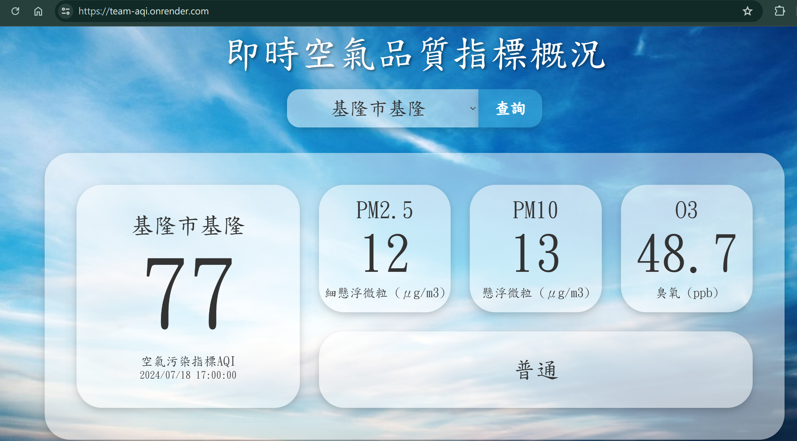
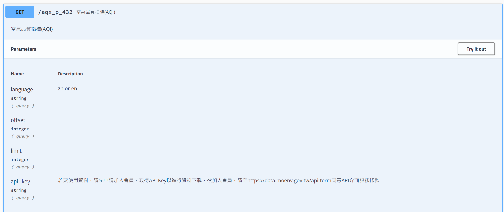
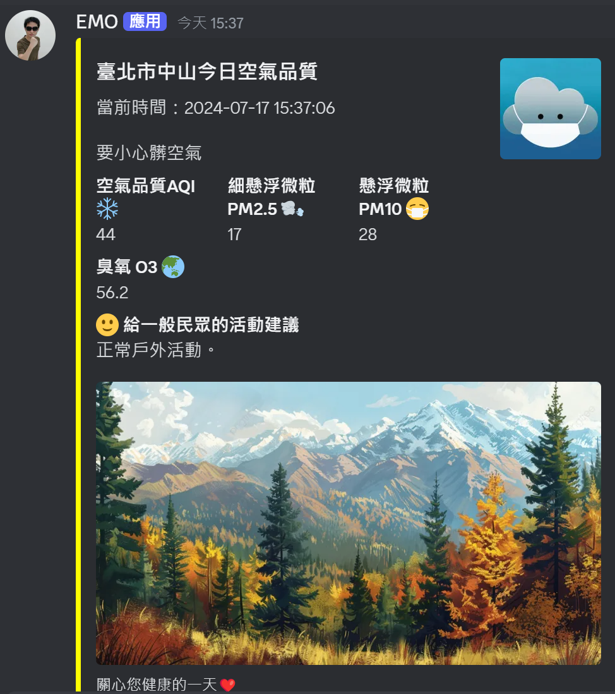
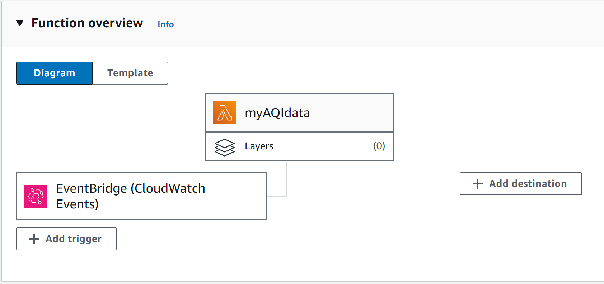

# team-aqi

# 專案分工
前端:雅君、承妤  
後端:智凱、弘斌

# 網站畫面
網站連結:  https://team-aqi.onrender.com/
  

# 雅君
1.初步的index.html、styles.css設置  
根據討論結果，設置初始的網頁版面，以便後端開發及JavaScript開發的同學進行測試和集成。  
2.網頁設計並完成styles.css  
完成整體的網頁設計，並根據設計完成CSS的編寫，使得頁面具有良好的視覺效果和使用體驗。  

# 承妤
1.javascript呼叫/api/siteList獲取測站清單，生成頁面測站名稱下拉式選單的選項  
2.javascript定義查詢按鈕，點擊按鈕呼叫/api/site/${station}獲取欲查詢測站的空氣品質數據，並將資料賦值到對應的css  

# 弘斌
1.利用 python requests套件取得政府空氣品質的原始資料  
使用的api:  
  
2.根據前端網頁需求資料格式，整理取得資料使用fastAPI 完成 測站列表及測站對應資料兩隻API  

# 智凱:
1.bot.py:  
將空氣品質相關資訊發送到discord內，測試內容如下:  
  
<!-- 2.使用model模組化bot.py, 在app.py的主程式中建立Scheduler task 定時執行 -->  
3.Review 所有組員的程式碼，確認無任何問題  
4.將程式佈署到Render.com，測試網站功能正常  
5.將原本程式使用Scheduler task 定時執行的功能移除，使用AWS服務來處理並發送(Lambda、Event bridge)  
  
